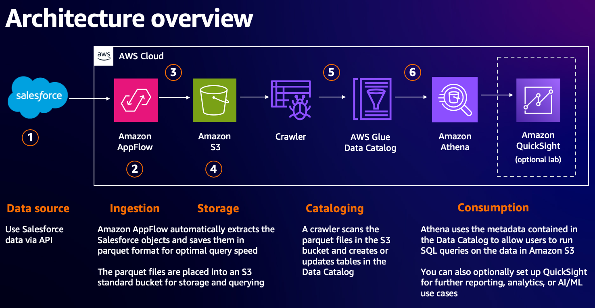
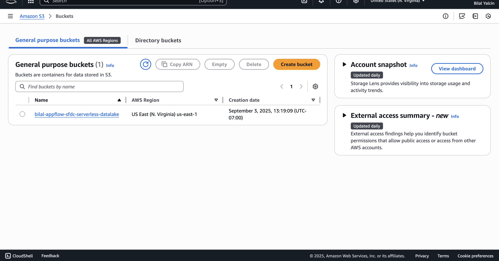
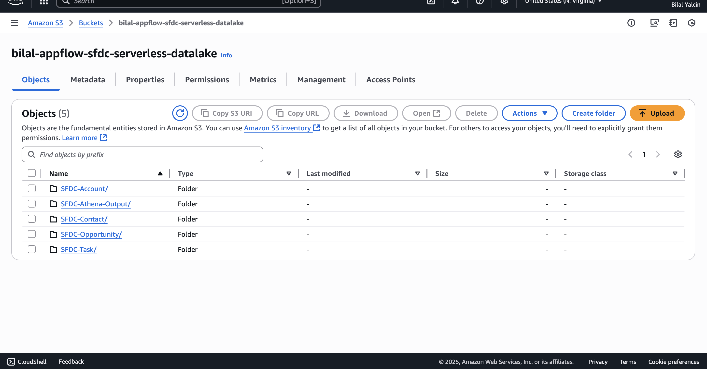
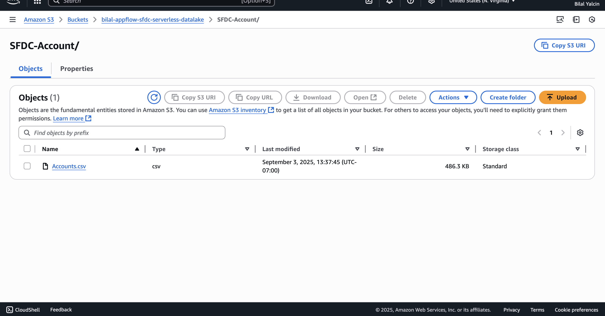
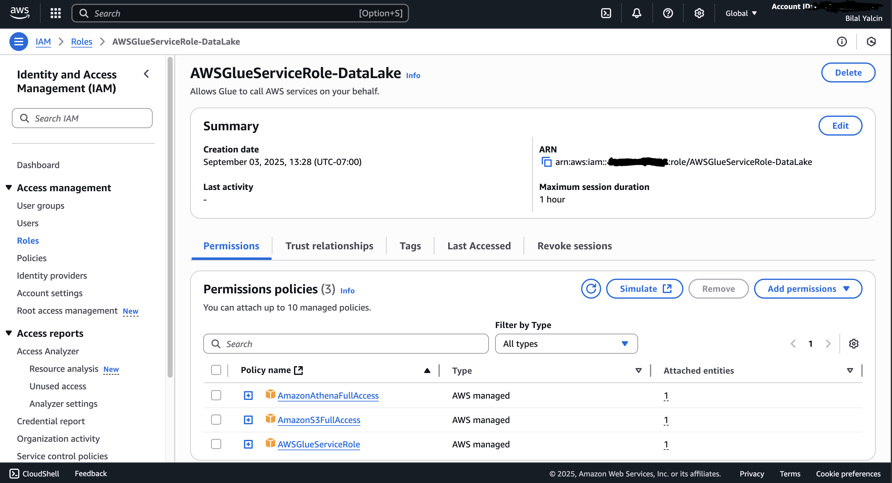
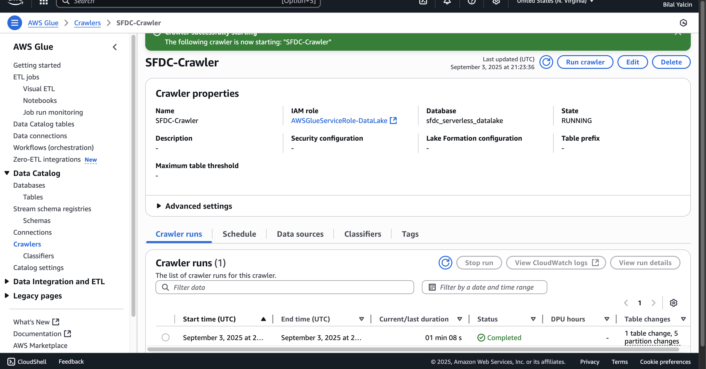
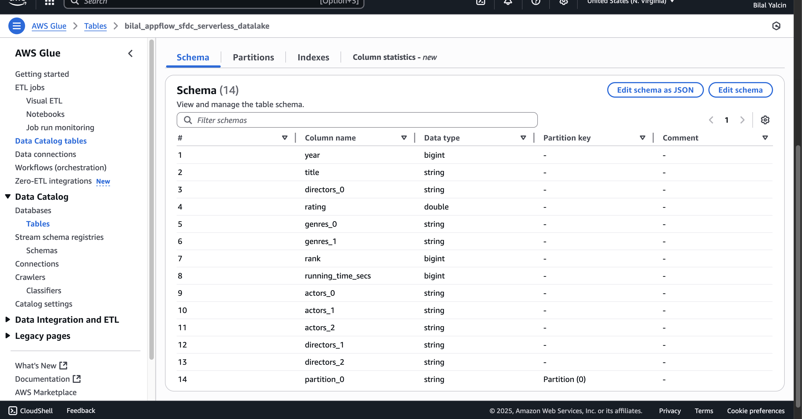
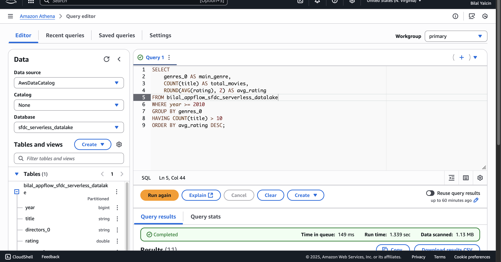
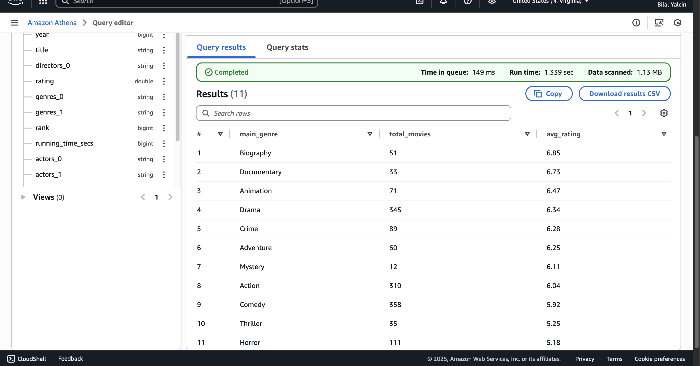

# 🚀 AWS Serverless Data Lake (S3 + Glue Data Catalog + Athena)

This repository documents my hands‑on build of a **serverless data lake** on AWS.  
The public re:Invent lab uses *Salesforce → AppFlow* for ingestion; I reproduced the pipeline using a **dummy CSV uploaded to S3** and completed the rest of the steps (**Glue Crawler → Glue Data Catalog → Athena**).

## 🗺️ Architecture

**Custom diagram (repo social preview recommended):**  


**Reference diagram from AWS workshop (credit: AWS re:Invent):**  


Flow: **CSV (simulated ingestion) → S3 → Glue Crawler → Glue Data Catalog → Athena**

---

## 📂 Repo Structure
```
.
├─ architecture/           # diagrams
├─ screenshots/            # console screenshots (see below)
├─ data/                   # optional sample CSVs (no PII)
├─ .gitignore
├─ LICENSE
└─ README.md
```

---

## 🧪 What I did (step‑by‑step)

### 1) S3 setup
- Created bucket for the lake and folders for objects:
  - `SFDC-Account/`, `SFDC-Contact/`, `SFDC-Opportunity/`, `SFDC-Task/`
  - `SFDC-Athena-Output/` (Athena results)
- Uploaded a **dummy CSV** under `SFDC-Account/`

📸 Screens:
- 
- 
- 

### 2) IAM role for Glue Crawler
- Created IAM role **`AWSGlueServiceRole-DataLake`**
- Attached policies: `AWSGlueServiceRole`, `AmazonS3FullAccess`, `AmazonAthenaFullAccess`

📸 Screen: 

### 3) Glue Crawler → Glue Data Catalog
- Crawler source: S3 path to the bucket/folders above
- Role: `AWSGlueServiceRole-DataLake`
- Output database: `sfdc_serverless_datalake`
- Ran the crawler → it created a table and inferred schema

📸 Screens:
- 
- 
- 

### 4) Query with Athena
- Set results location to `s3://bilal-appflow-sfdc-serverless-datalake/SFDC-Athena-Output/SFDC-Athena-Output/`
- Database: `sfdc_serverless_datalake`
- Example query I ran:
```sql
SELECT
  genres_0 AS main_genre,
  COUNT(title) AS total_movies,
  ROUND(AVG(rating), 2) AS avg_rating
FROM bilal_appflow_sfdc_serverless_datalake
WHERE year >= 2010
GROUP BY genres_0
HAVING COUNT(title) > 10
ORDER BY avg_rating DESC;
```

📸 Screens:
- 
- 

---

## ✅ Key Learnings
- Build a **no‑ops data lake** with S3 + Athena
- **Schema‑on‑read** via Glue Data Catalog (crawler infers schema from CSV)
- Separation of storage, metadata, and compute
- IAM role design for Glue; full S3 access for the lab (would scope down in production)

---

## 💵 Cost Notes
- S3 storage (few MB) ≈ negligible
- Athena charges per data scanned (use `LIMIT`, partitioning, or Parquet to minimize)

---

## 🧹 Cleanup
- Delete Athena results in `SFDC-Athena-Output/`
- Delete Glue crawler & database if not needed
- Delete the S3 bucket

---

## 🔖 Credits
- Architecture overview image adapted from the **AWS re:Invent No‑Code/Low‑Code Data Lake** workshop (for reference only).
- All other content/screenshots created by me during the hands‑on exercise.
